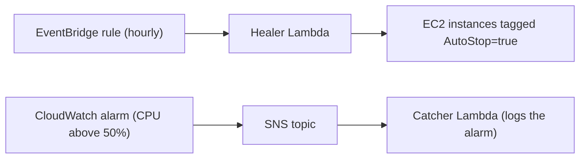

# Cloud Engineering Portfolio

AWS infrastructure built as code and shipped through a pipeline that holds no long-lived keys. The centrepiece is CloudOps Sentinel, a self-healing layer that stops idle EC2 instances on a schedule and records CPU alarms as they fire.

## What is in this repo

| Project | What it shows | Where |
|---|---|---|
| CloudOps Sentinel | A scheduled heal loop and a reactive alert loop, with least privilege enforced twice | [CloudOps-Sentinel.md](CloudOps-Sentinel.md), `projects/aws/terraform-infra/environments/global/`, `projects/aws/lambda/` |
| Terraform network and compute stack | Reusable modules, separate dev, prod and global environments, S3 remote state with native locking | `projects/aws/terraform-infra/` |
| CI/CD pipeline | GitHub Actions with OIDC federation and a manual approval gate | `.github/workflows/terraform.yml` |
| Earlier programme work | Operations scripts, boto3 scripts, networking notes, an S3 bucket module | `projects/aws/scripts/`, `projects/aws/python/`, `projects/aws/networking/`, `projects/aws/terraform/` |

## CloudOps Sentinel

An idle instance costs money all night. Sentinel runs two independent loops against a live EC2 workload.

- **Heal loop (proactive):** every hour, EventBridge invokes a Lambda that reads each running instance's average CPU for the past hour and stops any instance that is below 5% and tagged `AutoStop=true`.
- **Alert loop (reactive):** a CloudWatch alarm on CPU publishes to an SNS topic, and a catcher Lambda logs the alarm payload.
- **Code-first heal loop:** the IAM role, function, schedule, target and invoke permission are all in `healer.tf`. One `terraform apply` builds them from nothing, with no import.

### Design decisions

- **Least privilege, twice.** The IAM policy only allows `ec2:StopInstances` on instances carrying the AutoStop tag, and the function checks the same tag before acting. Either check alone is a single point of failure.
- **Reads open, writes gated.** Describing instances and reading CPU metrics are unconditioned, because the function has to see everything to decide. Only the stop action is fenced.
- **Two loops, not one clever one.** Sweeping on a schedule and reacting to alarms fail in different ways. Keeping them separate keeps each one easy to reason about and test.

### Infrastructure as code status

| Component | Status |
|---|---|
| Healer role, function, EventBridge rule, target, invoke permission | Terraform, code-first |
| SNS topic, catcher execution role | Terraform, imported |
| Catcher Lambda function, CloudWatch alarm | Hand-built, next to be rebuilt as code |

Full write-up, including how to demo it: [CloudOps-Sentinel.md](CloudOps-Sentinel.md)

## Terraform stack

- `modules/network` (VPC, public subnets across two AZs, internet gateway, route table, security group) and `modules/compute` (EC2 with a dynamic AMI lookup).
- `environments/dev` and `environments/prod` call the modules with separate S3 state keys. `environments/global` holds account-level resources: the GitHub Actions OIDC role and both Sentinel loops.
- State lives in a versioned, encrypted S3 bucket with public access blocked, locked natively with `use_lockfile = true`, so two runs cannot corrupt it at the same time.

## CI/CD pipeline

`.github/workflows/terraform.yml` runs validate and plan on every pull request, so the required checks always report. On pushes to `main` it runs only when files under `projects/aws/terraform-infra/` or the workflow itself change, so a docs commit never queues an apply.

1. **Validate:** `terraform fmt -check`, `init` with no backend, and `validate`. No AWS credentials needed.
2. **Plan:** assumes an AWS role through OIDC, initialises the S3 backend, runs `terraform plan` and posts the plan to the pull request.
3. **Apply:** runs only on pushes to `main`, inside the `production` environment, so it waits for a human to approve before anything changes.

**Why OIDC:** a pipeline holding an AWS access key is a leaked key waiting to happen. With OIDC, each run gets a short-lived token and no long-lived credential exists anywhere.

This is Continuous Delivery with a manual approval gate, not Continuous Deployment.

## Honest boundaries

- The pipeline plans and applies the dev environment. The global state, including Sentinel, is applied directly. Bringing it under the gated pipeline is a known follow-up.
- Single personal AWS account in us-east-1, not a multi-account setup.
- Sentinel stops idle instances. It does not restart or replace failed ones, and it is not highly available as built.

## Stack

AWS (EC2, VPC, IAM, Lambda, EventBridge, CloudWatch, SNS, S3) · Terraform · GitHub Actions · OIDC
